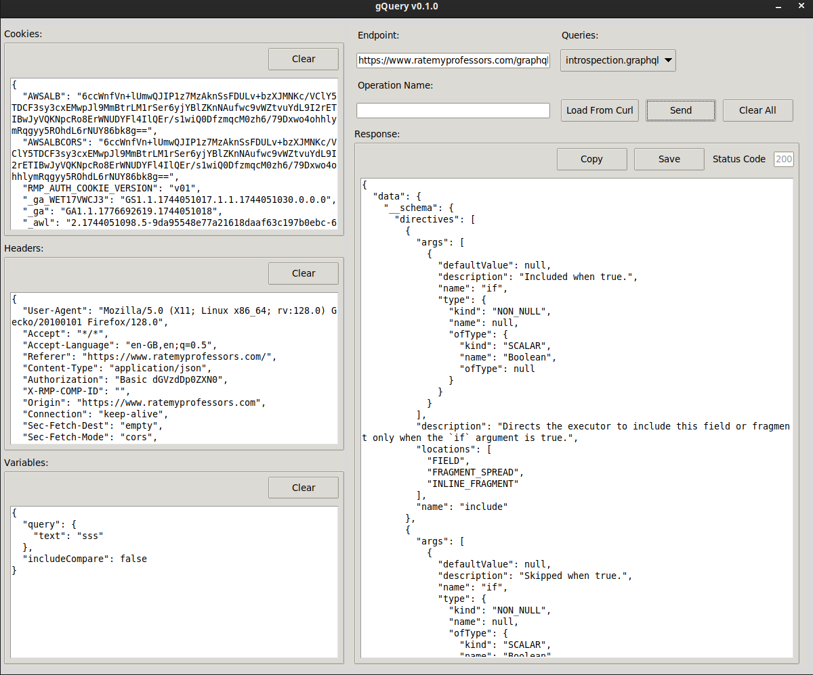

# gQuery
Lightweight and efficient GraphQL querying utilitiy

You can copy requests from dev-tools (copy as curl) and it will load the raw graphql request

And it will allow you to load queries from "Queries" directory and queries.json

